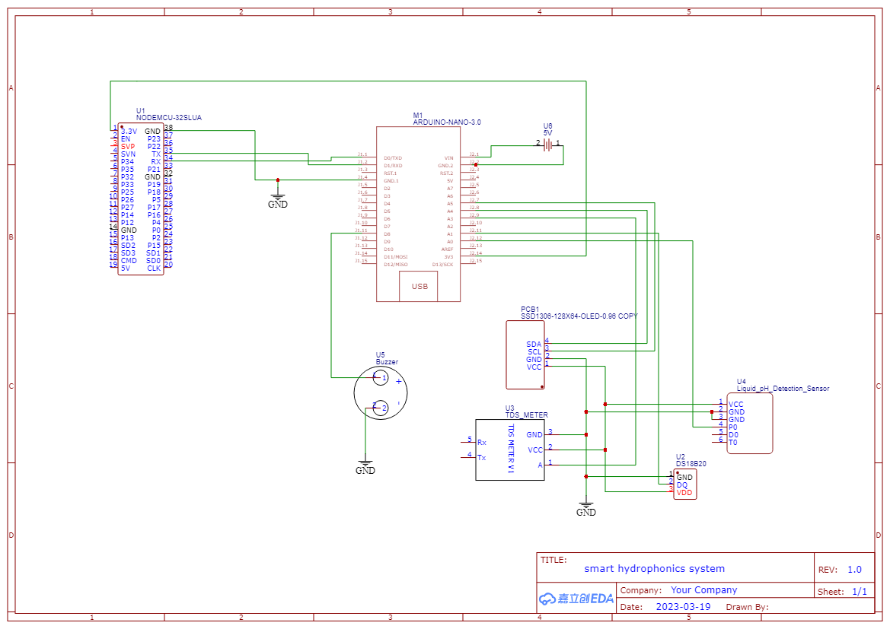

 

  

  <h3 align="center">Hydrophonics  System</h3>

  

    With Automatic Ph Level Control
     
     
    <a href="https://github.com/Dixon1323/smart-hydrophonics-system"><strong>Explore the docs »</strong></a>
     
     
  

   

## Table Of Contents

* [About the Project](#about-the-project)
* [Built With](#built-with)
* [Getting Started](#getting-started)
  * [Prerequisites](#prerequisites)
  * [Installation](#installation)
* [Usage](#usage)
* [Roadmap](#roadmap)
* [Contributing](#contributing)
* [License](#license)
* [Authors](#authors)
* [Acknowledgements](#acknowledgements)

## About The Project

## Features

- OLED Display: Provides real-time information about the hydroponics system.
- Motor Pumps: Controls the pH level by adjusting the water flow.
- IoT Messaging Services: Integrates with Telegram to send notifications and receive commands.

## Built With

Arduino and Love ❤❤

## Getting Started

Do all the connections according to the Circuit Diagram

### Prerequisites

Arduino IDE
Arduino nano
Esp8266_nodemcu
Working WiFi

### Installation

To get started with the Smart Hydroponics System, follow these steps:

1. Clone the repository: `git clone https://github.com/your-username/your-repo.git`
2. Install the required dependencies.
3. Configure the Telegram bot token and other settings.
4. Run the main script to start the system.

## Roadmap

See the [open issues](https://github.com/Dixon1323/smart-hydrophonics-system/issues) for a list of proposed features (and known issues).

## Contributing

Contributions are what make the open source community such an amazing place to be learn, inspire, and create. Any contributions you make are **greatly appreciated**.
* If you have suggestions for adding or removing projects, feel free to [open an issue](https://github.com/Dixon1323/smart-hydrophonics-system/issues/new) to discuss it, or directly create a pull request after you edit the *README.md* file with necessary changes.
* Please make sure you check your spelling and grammar.
* Create individual PR for each suggestion.
* Please also read through the [Code Of Conduct](https://github.com/Dixon1323/smart-hydrophonics-system/blob/main/CODE_OF_CONDUCT.md) before posting your first idea as well.

### Creating A Pull Request

1. Fork the Project
2. Create your Feature Branch (`git checkout -b feature/AmazingFeature`)
3. Commit your Changes (`git commit -m 'Add some AmazingFeature'`)
4. Push to the Branch (`git push origin feature/AmazingFeature`)
5. Open a Pull Request

## License

Distributed under the MIT License. See [LICENSE](https://github.com/Dixon1323/smart-hydrophonics-system/blob/main/LICENSE.md) for more information.
